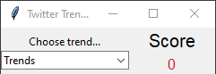

# Twitter Trend Sentiment Analysis

  Displays an average of how people feel about any given trend

## Table of Contents

* [General Info](#general-information)
* [Technologies Used](#technologies-used)
* [Features](#features)
* [Screenshots](#screenshots)
* [Setup](#setup)
* [Project Status](#project-status)
* [Contact](#contact)

## General Information

  Choose on of the top 50 trends in the US, and an average score from -100 to 100 will be displayed. The lower the score the more negative people on feel about the trend, the higher the score, the more positive people feel about the trend.

## Technologies Used

* Python 3.10.0
* Tweepy
* Tkinter
* TextBlob

## Features

* Choose one of 50 US trends
* Display average sentiment score

## Screenshots

## Setup

`$ pip install -r requirements.txt`

## Project Status

Project is: _finished_

## Contact

[Check out my GitHub](https://github.com/ethan-pt)

[Send me an Email](mailto:tubbeethan@gmail.com)
